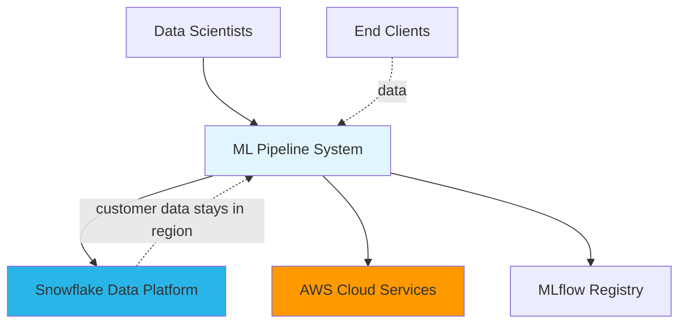
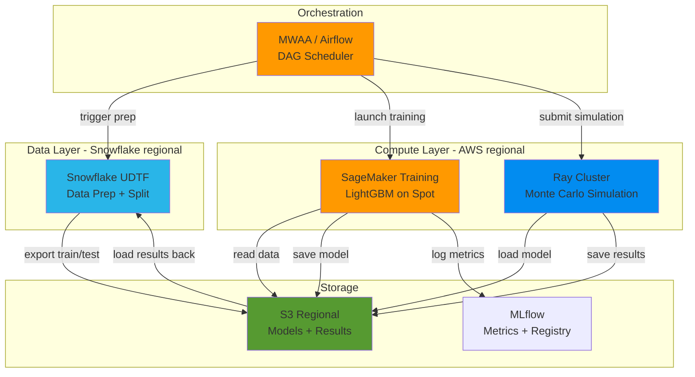

# Architecture Documentation

Proposed AWS+Snowflake architecture for scaling the monthly ML pipeline from ~50 runs/day to thousands of runs/day.

---

## C4 Level 1: System Context

- **Snowflake**: Customer data storage and preprocessing. Data stays in origin region.
- **AWS**: Orchestration (MWAA/Airflow), training (SageMaker), simulation (Ray).
- **MLflow**: Central model registry, metrics tracking, retrain decision audit trail.

---

## C4 Level 2: Container Diagram

---

## C4 Level 3: Single Client Pipeline

**Steps:**

1. **Data Prep + Split** (Snowflake) — UDTF extracts last month's data, imputes nulls, casts types. Session-aware train/test split (no leakage). Output: 31-column train/test sets exported to S3.

2. **SageMaker Training Job** (with built-in retrain check) — Job starts, reads test data and champion model from S3. Evaluates champion on new test set. If degradation > 5%, continues to train LightGBM on 1M rows, logs metrics to MLflow, saves new model to S3. If performance OK, exits early (saving compute cost). Either way, logs the decision to MLflow for audit.

3. **Monte Carlo Simulation** (Ray) — Airflow launches Ray job. Sample 2M rows, 300 perturbation evaluations per row. Model broadcast once via `ray.put()` to worker shared memory. Data chunked and distributed as parallel `@ray.remote` tasks. Results saved to S3, loaded back into Snowflake.

---

## Old vs New Architecture

| | Old (Dataiku) | New (AWS + Snowflake) |
|---|---|---|
| **Execution** | Sequential, 1 client at a time | Parallel, 50 concurrent clients |
| **Data prep** | S warehouse, sequential | S warehouse, multi-cluster concurrent |
| **Training** | Shared 4 vCPU / 32 GB | Dedicated SageMaker spot instances |
| **Simulation** | 3 joblib processes | Ray cluster, 10-50 nodes |
| **Model strategy** | Always retrain | Retrain only when degraded |
| **Daily capacity** | ~50 clients | ~4,000+ clients |
| **Scaling** | Manual, fixed resources | Auto-scaling, burst on Day 1 |
| **Cost model** | Fixed enterprise license | Pay-per-use |

**Throughput math** (worst case):
- Pipeline per client: ~23 min
- With model reuse (~65% skip training): ~15 min average
- 50 concurrent pipelines: `(24h x 60 / 15) x 50 = 4,800 clients/day`

---

## Local Demo to Production Mapping

| Local (docker-compose) | Production (AWS) |
|---|---|
| Postgres | RDS PostgreSQL |
| Airflow standalone | MWAA (Managed Airflow) |
| MLflow on filesystem | MLflow on ECS + S3 |
| Ray head + 2 workers | Ray on EKS, auto-scaled, spot |
| DuckDB (fake Snowflake) | Snowflake regional warehouses |
| Synthetic data generation | Snowflake UDTF on real data |
| PythonOperator | SageMakerTrainingOperator |
| Local filesystem | S3 regional buckets |
| Manual DAG trigger | Airflow cron (1st of month) |