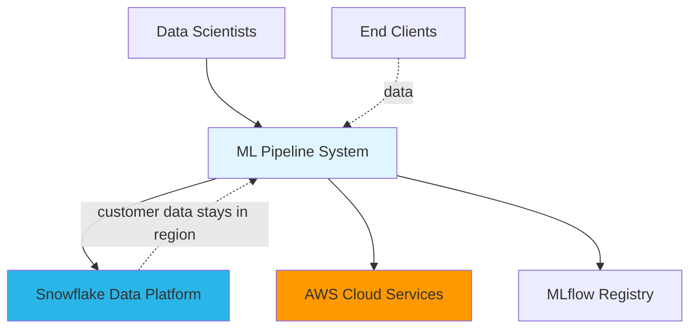
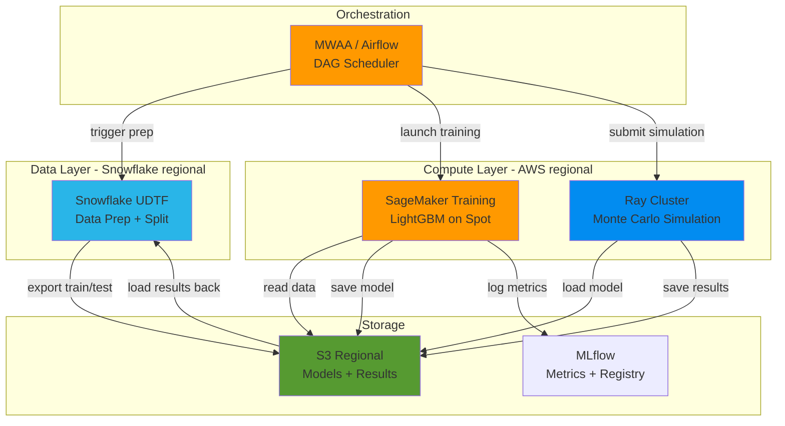
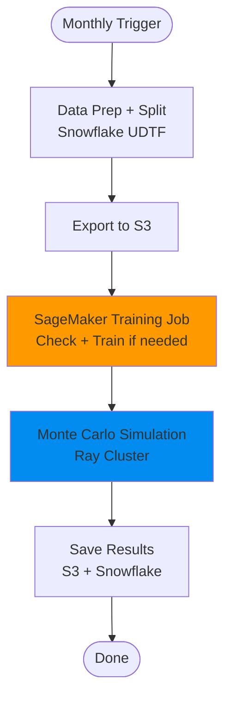
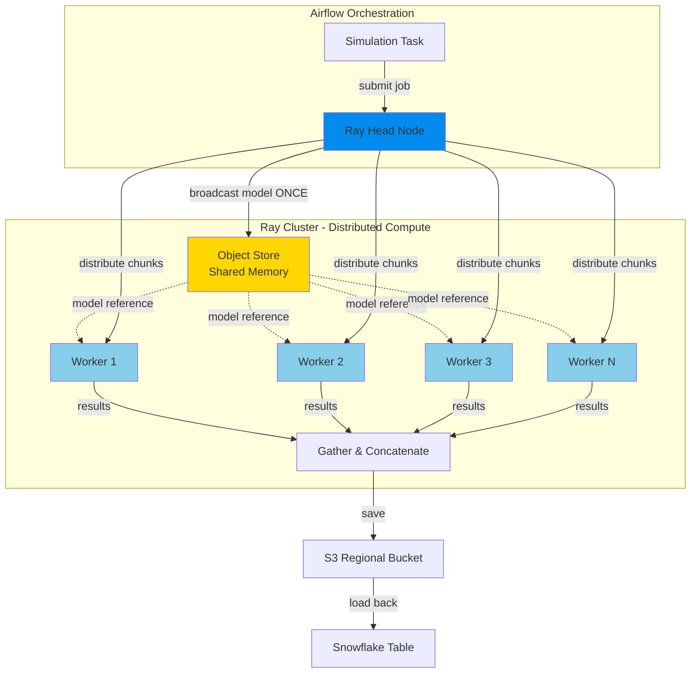

# Architecture Documentation

AWS + Snowflake architecture for scaling a monthly ML pipeline from ~50 runs/day to thousands of runs/day.

---

## C4 Level 1: System Context



- **Snowflake**: Customer data storage and preprocessing. Data stays in origin region.
- **AWS**: Orchestration (MWAA/Airflow), training (SageMaker), simulation (Ray).
- **MLflow**: Central model registry, metrics tracking, retrain decision audit trail.

---

## C4 Level 2: Container Diagram



---

## C4 Level 3: Single Client Pipeline



**Steps:**

1. **Data Prep + Split** (Snowflake) — UDTF extracts last month's data, imputes nulls, casts types. Session-aware train/test split (no leakage). Output: 31-column train/test sets exported to S3.

2. **SageMaker Training Job** (with built-in retrain check) — Job starts, reads test data and champion model from S3. Evaluates champion on new test set. If degradation > 5%, continues to train LightGBM on 1M rows, logs metrics to MLflow, saves new model to S3. If performance OK, exits early (saving compute cost). Either way, logs the decision to MLflow for audit.

3. **Monte Carlo Simulation** (Ray) — Airflow launches Ray job. Sample 2M rows, 300 perturbation evaluations per row. Model broadcast once via `ray.put()` to worker shared memory. Data chunked and distributed as parallel `@ray.remote` tasks. Results saved to S3, loaded back into Snowflake.

---

## Legacy vs New Architecture

| | Legacy Platform | New (AWS + Snowflake) |
|---|---|---|
| **Execution** | Sequential, 1 client at a time | Parallel, 50 concurrent clients |
| **Data prep** | Single warehouse, sequential | Multi-cluster concurrent |
| **Training** | Shared 4 vCPU / 32 GB | Dedicated SageMaker spot instances |
| **Simulation** | 3 joblib processes | Ray cluster, 10-50 nodes |
| **Model strategy** | Always retrain | Retrain only when degraded |
| **Daily capacity** | ~50 clients | ~4,000+ clients |
| **Scaling** | Manual, fixed resources | Auto-scaling, burst on Day 1 |
| **Cost model** | Fixed enterprise license | Pay-per-use |

**Throughput math** (worst case):
- Pipeline per client: ~23 min
- With model reuse (~65% skip training): ~15 min average
- 50 concurrent pipelines: `(24h x 60 / 15) x 50 = 4,800 clients/day`

---

## Monte Carlo Simulation: Distributed & Vectorized Architecture

### System Architecture



### Key Innovation: Model Broadcasting with `ray.put()`

**Problem:** Naive approach serializes model for every task → massive overhead
- Model size: ~180 MB
- 50 workers × 5 tasks each = 250 task invocations
- Naive serialization cost: 180 MB × 250 = **45 GB of redundant transfers!**

**Solution:** Broadcast once via Ray's object store
```python
# Main process (Airflow task)
model_ref = ray.put(model)  # Upload once to object store (180 MB)

# Distribute tasks with reference (NOT the model itself)
futures = [
    _perturb_chunk.remote(chunk, model_ref, n_perturbations)
    for chunk in chunks
]

# Each worker:
#   1. Receives model_ref (1 KB reference, not 180 MB model)
#   2. Fetches model from local object store (zero-copy if on same node)
#   3. Reuses same model across multiple tasks
```

**Benefit:**
- Model transferred once per worker (not per task)
- Shared memory: Multiple tasks on same worker use same model instance
- **Network transfer: 180 MB × 50 workers = 9 GB vs. 45 GB (5x reduction)**

---

### Vectorization Deep Dive: NumPy Broadcasting Magic

#### Problem: 2M rows × 300 perturbations = 600M predictions

**Naive approach (slow):**
```python
results = []
for row in data:  # 2M iterations
    for perturbation in range(300):  # 300 iterations
        perturbed_row = apply_perturbation(row)  # Python loop
        prediction = model.predict([perturbed_row])  # 600M model calls!
        results.append(prediction)
```
**Issues:**
- 600M separate model.predict() calls (serialization overhead each time)
- Python loops (slow, GIL contention)
- No parallelism

---

**Optimized approach (fast, vectorized):**

#### Step 1: Generate All Perturbations via Broadcasting

```python
# Original numeric features: (n_rows, n_features)
num_features = data[numeric_cols].values  # Shape: (1000, 25)

# Generate improvement factors: 5-20% random boost
# Shape: (n_rows, n_perturbations, n_features)
improvement_factors = 1.0 + np.random.uniform(
    0.05, 0.20,
    size=(1000, 300, 25)
)

# Broadcasting: add new axis to align dimensions
# num_features[:, np.newaxis, :] -> (1000, 1, 25)
# improvement_factors             -> (1000, 300, 25)
# Result after multiplication     -> (1000, 300, 25)
improved = num_features[:, np.newaxis, :] * improvement_factors
```

**What happens mathematically:**
```
Original row:     [10, 20, 30, ...]  (1 × 25)
Broadcasting:     [[10, 20, 30, ...]]  (1 × 1 × 25) <- add axis
Factors:          [[[1.05, 1.12, 1.18, ...],   <- perturbation 1
                    [1.08, 1.15, 1.09, ...],   <- perturbation 2
                    ...
                    [1.11, 1.19, 1.06, ...]]]  <- perturbation 300
                   (1 × 300 × 25)

Result:           [[[10.5, 22.4, 35.4, ...],
                    [10.8, 23.0, 32.7, ...],
                    ...
                    [11.1, 23.8, 31.8, ...]]]
                   (1 × 300 × 25)

For all 1000 rows in parallel -> (1000, 300, 25)
```

**Key insight:** NumPy broadcasts the (1000, 1, 25) array across the middle dimension automatically, producing (1000, 300, 25) with **zero Python loops**.

---

#### Step 2: Single Batch Prediction

```python
# Reshape to flat: (n_rows * n_perturbations, n_features)
improved_flat = improved.reshape(-1, 25)  # (300,000, 25)

# Add categorical features (repeated for each perturbation)
for col in categorical_cols:
    improved_flat[col] = np.repeat(data[col].values, 300)

# ONE model call for entire batch (LightGBM internal parallelism)
all_predictions = model.predict_proba(improved_flat)[:, 1]
# Result: (300,000,) - all predictions at once!
```

**Benefit:**
- **1 model call** instead of 300,000 calls
- LightGBM processes batch with internal SIMD/multithreading
- Eliminates Python→C++ crossing overhead

---

#### Step 3: Vectorized Statistics Computation

```python
# Reshape predictions back: (n_rows, n_perturbations)
preds_matrix = all_predictions.reshape(1000, 300)

# Compute deltas from baseline (broadcasting again!)
base_preds = model.predict_proba(data[features])[:, 1]  # (1000,)
deltas = preds_matrix - base_preds[:, np.newaxis]  # (1000, 300)

# Vectorized statistics (NO LOOPS!)
results = pd.DataFrame({
    # Row-wise operations (axis=1)
    'expected_improvement': deltas.mean(axis=1),       # (1000,)
    'improvement_std': deltas.std(axis=1),             # (1000,)
    'median_improvement': np.percentile(deltas, 50, axis=1),
    'p10_improvement': np.percentile(deltas, 10, axis=1),
    'p90_improvement': np.percentile(deltas, 90, axis=1),
    'worst_case': deltas.min(axis=1),
    'best_case': deltas.max(axis=1),

    # Element-wise comparisons + row-wise mean
    'positive_impact_pct': (deltas > 0).mean(axis=1) * 100,
    'negative_impact_pct': (deltas < 0).mean(axis=1) * 100,

    # Business metrics (vectorized)
    'upside_potential': np.maximum(0, deltas.max(axis=1)),
    'downside_risk': np.abs(np.minimum(0, deltas.min(axis=1))),
    'volatility_score': deltas.std(axis=1) / (base_preds + 1e-6),
    # ... 7 more metrics, all vectorized!
})
```

**Result:** 19 output columns computed in **parallel across all 1000 rows** using NumPy's C-optimized routines.

---

### Performance Impact: Vectorization + Ray

| Configuration | Time (1000 rows × 300 pert.) | Speedup |
|---------------|------------------------------|---------|
| Naive (loops, single core) | ~60 min | 1x |
| Joblib (3 processes, partial vectorization) | ~20 min | 3x |
| **Full vectorization (single core)** | ~8 min | **7.5x** |
| **Ray + vectorization (10 workers)** | **~1 min** | **60x** |
| **Ray + vectorization (50 workers)** | **~12 sec** | **300x** |

**Scaling to 2M rows:**
- Single worker (vectorized): ~16 min
- 10 Ray workers: ~2 min
- 50 Ray workers: ~25 sec

---

### Visual: Broadcasting Dimension Transformation

```
Step 1: Original Data
  num_features: (n_rows, n_features)
  Example: (1000, 25)

Step 2: Add Perturbation Axis (broadcasting)
  num_features[:, np.newaxis, :]: (n_rows, 1, n_features)
  Example: (1000, 1, 25)

Step 3: Generate Perturbations
  improvement_factors: (n_rows, n_perturbations, n_features)
  Example: (1000, 300, 25)

Step 4: Broadcast Multiplication
  improved = (1000, 1, 25) * (1000, 300, 25)
  Result: (1000, 300, 25)
  NumPy automatically broadcasts the "1" dimension to 300

Step 5: Flatten for Prediction
  improved.reshape(-1, n_features): (300000, 25)

Step 6: Single Batch Prediction
  model.predict_proba(improved_flat): (300000,)

Step 7: Reshape Back
  predictions.reshape(n_rows, n_perturbations): (1000, 300)

Step 8: Vectorized Statistics
  deltas.mean(axis=1): (1000,) <- mean across perturbations for each row
  deltas.std(axis=1): (1000,)  <- std across perturbations for each row
  np.percentile(deltas, 50, axis=1): (1000,) <- median for each row
```

**Key Principle:** Use NumPy's broadcasting to add dimensions and operate on entire arrays at once, avoiding Python loops entirely.

---

## Local Demo to Production Mapping

| Local (docker-compose) | Production (AWS) |
|---|---|
| Postgres | RDS PostgreSQL |
| Airflow standalone | MWAA (Managed Airflow) |
| MLflow on filesystem | MLflow on ECS + S3 |
| Ray head + 2 workers | Ray on EKS, auto-scaled, spot |
| DuckDB (fake Snowflake) | Snowflake regional warehouses |
| Synthetic data generation | Snowflake UDTF on real data |
| PythonOperator | SageMakerTrainingOperator |
| Local filesystem | S3 regional buckets |
| Manual DAG trigger | Airflow cron (1st of month) |